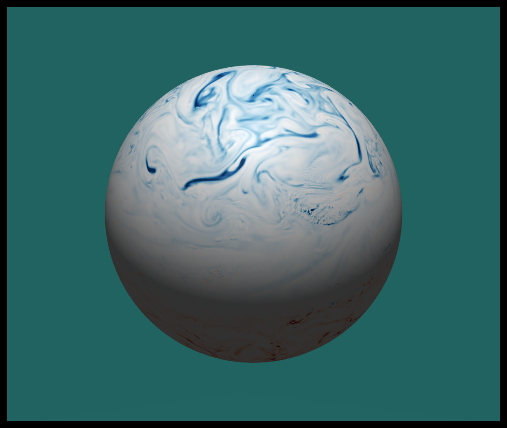
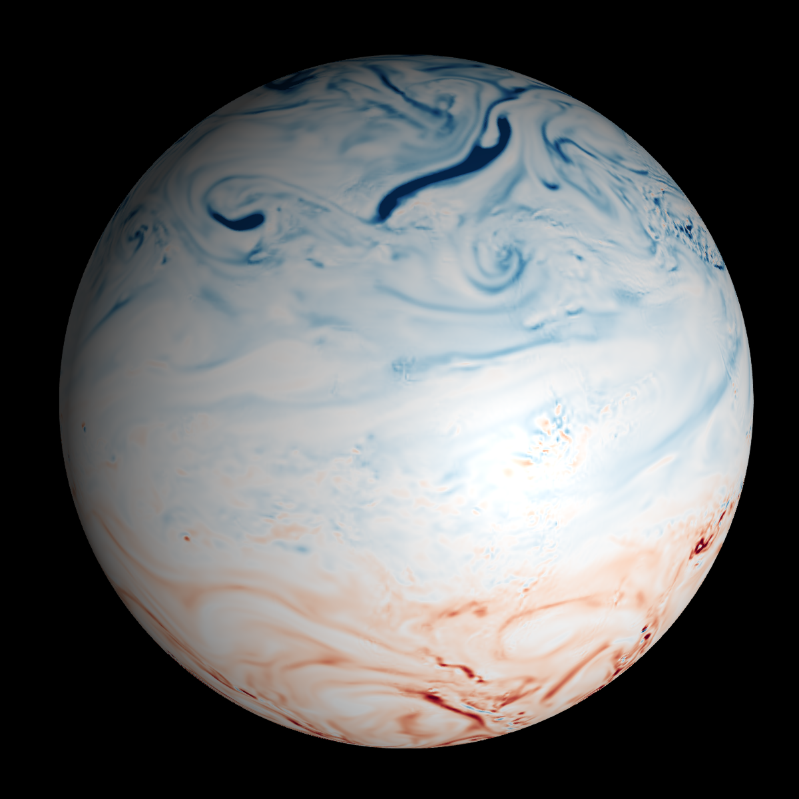

# NCPlots 


Plots NetCdf files using CF convention



# Example PV era5
```
ds = Dataset("pv.nc)
data = view(ds,level=1,time=1)
fig = Figure()
ax = Axis3(fig[1,1])
surface3!(ax,data["pv"],colormap=:RdBu,colorrange=(-0.02,0.02))
```




# Geopotential movie


## Example 

```julia
using NCPlots, GLMakie, NCDatasets

ds = Dataset("east_domain.nc") 
lons = ds["longitude"][:]
lats = ds["latitidue"][:]
data = ds["t"][:,:,65]

fig = Figure()
ax = LScene(fig[1,1], lons,lats,data)
surface2!(ax,lons,lats,data) 
```


## Multiple plots 

```julia
ds2 = Dataset("west_domain.nc") 
lons2 = ds["longitude"][:]
lats2 = ds["latitidue"][:]
data2 = ds["t"][:,:,65]
surface2!(ax,lons2,lat2,data2)
```


## Animations 

```
using NCDatasets, GLMakie, NCPlots
ds = Dataset("geopotential_2020.nc")
dsz = ds["z"]
lons = ds["longitude"]
lats = ds["latitude"]
x,y,z = NCPlots.lonlat2xyz(lons,lats)
t = Observable(1)
geop = @lift(nomissing(dsz[:,:,$t]))
xg = @lift($geop.*x)
yg = @lift($geop.*y)
zg = @lift($geop.*z)

fig = Figure()
ax = Axis3(fig[1,1], viewmode=:fit)
surface!(ax,xg,yg,zg,color=geop,colormap=:RdBu)
maxg = maximum(geop.val)
hidedecorations!(ax)
hidespines!(ax)
ax.protrusions=0

record(fig,"geop.mp4", 1:100,framerate=10) do ti
  t[]=ti
end
```


To color deparatures from zonal mean 

```
dep = @lift($geop .- mean($geop,dims=1))
```


# Envar 


```julia
rearth  = 20000.0 # set smaller then earth Radius 
ands = Dataset("envar/2019081803/MXMIN1999+0000.nc")
fgds = Dataset("envar/2019081800/ICMSHHARM+0003.nc")
lats = fgds["latitude"][:];
lons = fgds["longitude"][:]
geop = fgds["SPECSURFGEOPOTEN"][:,:]
x,y,z = NCPlots.lonlat2xyz(lons,lats,rearth .+ geop./9.8)

var= "S065TEMPERATURE"
fg = nomissing(fgds[var][:,:])
an = nomissing(ands[var][:,:])

fig  = Figure(resolution=(1200,1200))
ax = Axis3(fig[1,1], viewmode=:fit)
surface!(ax,x,y,z,color=an-fg,colormap=Reverse(:RdBu),colorrange=(-0.5,0.5))
```


# Plotting data from MEPS at MET Norway


```julia
archive="/lustre/storeB/immutable/archive/projects/metproduction/MEPS/"
ds = Dataset("$archive/2023/10/01/meps_det_2_5km_20231001T00Z.nc")
field = view(ds,hybrid=65,time=1)["air_temperature_ml"]
surface3!(field)
```

